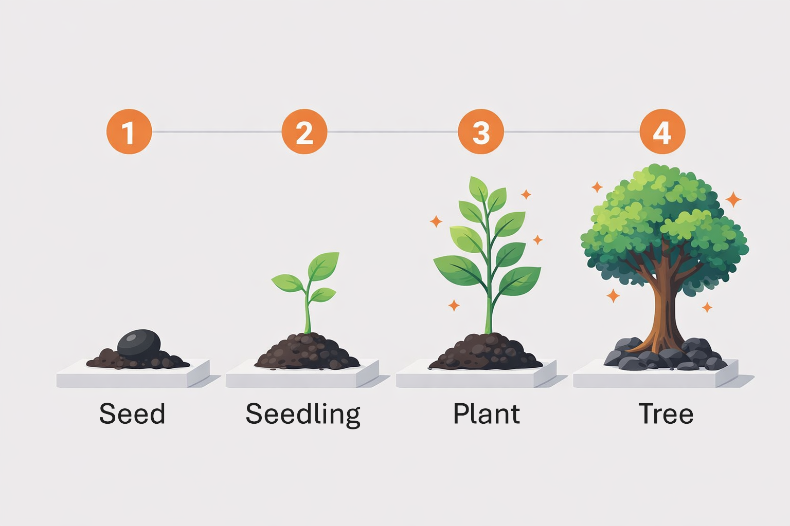

# SPFx Learning Ladder

A 4-step progressive learning path for SharePoint Framework (SPFx) developers. Each stage builds on the previous one, introducing new concepts while maintaining a consistent, durable project structure.



## Stages

| Stage | Folder | Description |
|-------|--------|-------------|
| 1 | [1-Seed](1-Seed/) | Project structure, barrel exports, React component basics, localization, theming |
| 2 | [2-Seedling](2-Seedling/) | Graph API, OneDrive browsing, React hooks, Fluent UI components |
| 3 | [3-Plant](3-Plant/) | Graph pagination, user directory, debounced search, utility functions, property pane toggles |
| 4 | [4-Tree](4-Tree/) | PnP/JS CRUD, IndexedDB caching (Dexie), Kendo React Grid, service/cache layers |

## How to Use

1. Start with **1-Seed** -- understand the project structure and design patterns
2. Move to **2-Seedling** -- compare it with 1-Seed to see what changed and why
3. Continue through **3-Plant** and **4-Tree**, each time diffing against the previous stage

## Getting Started

Each stage is a standalone SPFx project. To run any stage:

```bash
cd <Stage>/app
npm install
npm start
```

## Comparing Stages

To see what changed between stages, diff the folders:

```bash
diff -r 1-Seed/app/src 2-Seedling/app/src
```

## Tech Stack

- SharePoint Framework 1.22.2
- React 17
- TypeScript 5.8
- Fluent UI React 8
- Heft build system
